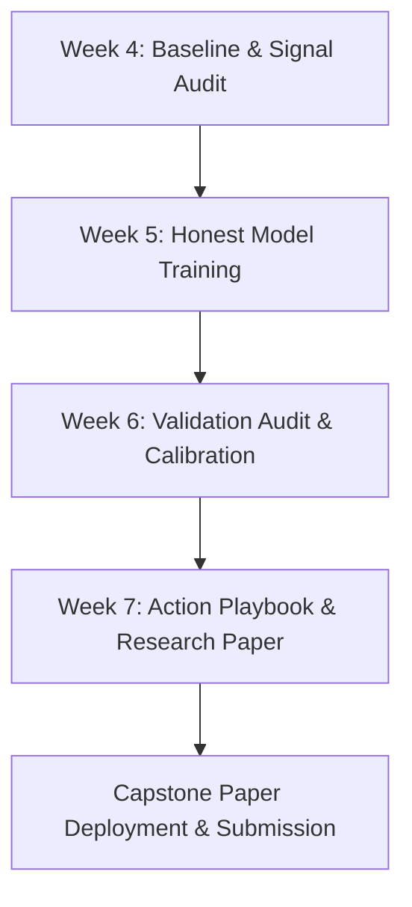

# 🌟 The Standout ML Intern Blueprint: Vinayak (ErenSnowh)

> **Goal:** Move from a candidate who "completed the assignments" to an ML engineer who **ships production-ready, leak-free decision support systems** with rigorous validation and publication-grade reporting.

---

## 🎯 What Separates Average Submissions from Top 1% Submissions

| Axis | Average Intern Submission | **Your Standout Standard (Vinayak)** |
|---|---|---|
| **Validation Design** | Random 80/20 row train/test split (suffers from cross-page client leakage) | **Client-Holdout Split** (~20% unseen clients) + **Time-Aware Split** for forward window validation |
| **Leakage Awareness** | Checks for leakage only when prompted | **Automated assertions in every notebook**; explicit documentation of safe vs. unsafe feature windows |
| **Primary Metrics** | Generic Accuracy or ROC-AUC without operational context | **Precision@20 & Precision@50** (measuring actual editorial review capacity) vs. Base Rate |
| **Outputs** | Raw probabilities or arbitrary float scores | **Ranked priority queues with human-readable reason codes** + concrete action labels |
| **Critical Thinking** | Accepts top model predictions at face value | **Skeptic's Audit** on top picks: identifying weak picks, zero-click SERPs, and seasonal noise |
| **Paper & Reporting** | Superficial summary with generic bullet points | **Publication-grade research paper** with SVG figures, reproducible JSON receipts, and careful causal bounds |

---

## 🗺️ Roadmap to Capstone Excellence (Weeks 5 – 7)

### 1. **Week 05 — Model Training (ML-08)**
* **Target:** Train and compare multiple models (Logistic Regression, Decision Tree, Random Forest, XGBoost/LightGBM).
* **Standout Move:** Benchmark every model directly against your **Baseline Score (0.340 Precision@50)**. Feature importance analysis with gain metrics and SHAP values.

### 2. **Week 06 — Validation Audit (ML-09)**
* **Target:** Deep-dive into model errors, probability calibration, and client-wise variance.
* **Standout Move:** Probability calibration curves (Brier score), error analysis by content type, and stability testing across different client slices.

### 3. **Week 07 — Action Playbook & Research Paper (ML-10, ML-11, ML-12)**
* **Target:** Build final action playbook and deploy static research paper page.
* **Standout Move:** Clean HTML/SVG paper deployment with full reproducibility, social-cut summary, and executive demo outline.

---

## 🔒 The 5 Golden Rules of Defensible Claims

1. **Say "Observed Association"**, Never "Proved Causation" (unless using a controlled A/B test).
2. **Never Claim Algorithm Hacks:** You are modeling search & user performance signals, not reverse-engineering Google's proprietary algorithm.
3. **Always State Sample Floors:** Never report rates without showing the denominator ($n$).
4. **Never Commit Raw Data:** Datasets stay in `data/raw/` (gitignored). Commit code, JSON receipts, and figures only.
5. **Keep CI Green:** Clean build, zero dataset CSVs committed, passing tests.

---

*This blueprint has been saved into your workspace rules (`.agents/AGENTS.md`) and will guide all subsequent week implementations.*
